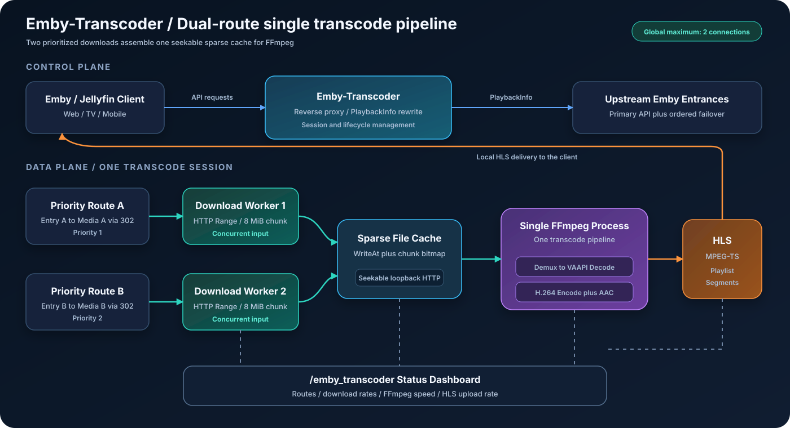
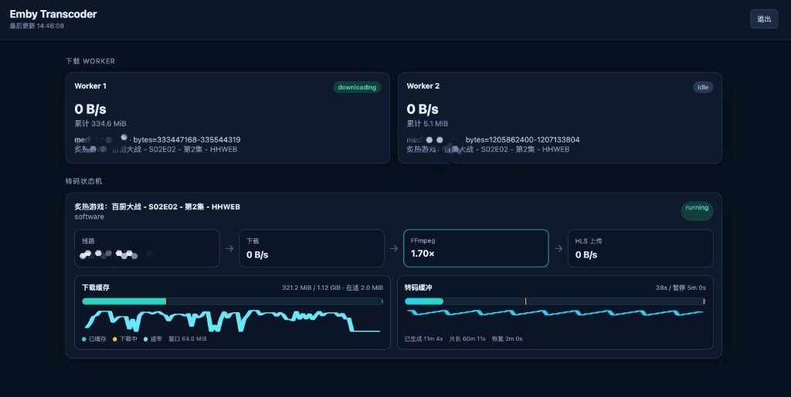

# Emby-Transcoder

[English](README.en.md)

[](https://github.com/tces1/emby_transcoder/actions/workflows/docker-image.yml)
[](https://hub.docker.com/r/tces1/emby_transcoder)
[](https://hub.docker.com/r/tces1/emby_transcoder)
[](go.mod)
[](docker/Dockerfile)
[](#转码生命周期)
[](#配置)
[](LICENSE)

Emby-Transcoder 是一个轻量级 Go 反向代理，为 Emby 和 Jellyfin 客户端补充本地 FFmpeg HLS 转码能力。

它的目标很窄：普通 API 请求继续透明转发到上游服务；命中配置规则的客户端请求 `PlaybackInfo` 时，会收到由代理提供的 HLS `TranscodingUrl`。

## 工作方式



## 当前功能

- 原生 Go 二进制，适合 Linux 部署。
- 普通 Emby/Jellyfin 请求透明反向代理。
- 按 `User-Agent`、`X-Emby-Authorization` 和 `X-MediaBrowser-Token` 匹配客户端配置。
- 对命中的客户端重写 PlaybackInfo。
- 本地 FFmpeg HLS 会话路径为 `/streambridge/transcode/`。
- 支持通过 Emby `AudioStreamIndex` 选择音轨，切换音轨时会重启本地转码。
- 通过 Emby `/Sessions/Playing*` check-in 和 HLS 访问跟踪播放生命周期。
- 输出目标保守固定为 H.264 视频、AAC 音频、HLS MPEG-TS 分片。
- 软件转码和 VAAPI 兼容管线会把视频限制到 1920x1080；可用时优先使用完整 VAAPI 管线。
- 仅在客户端请求 HLS playlist 或分片时启动转码，浏览详情页不会预下载。
- FFmpeg 使用低延迟启动和 GOP 参数，降低首分片延迟。
- 可选用双线路 HTTP Range 下载，将分块按偏移写入本地稀疏缓存，再通过可 Seek 的本地 HTTP 输入 FFmpeg。

不包含：虚拟媒体库、RSS、封面生成、刮削、数据库存储或管理 UI。

## 直接运行

```bash
go run ./cmd/emby-transcoder -config config.example.json
```

然后让客户端连接代理地址，例如 `http://linux-host:8097`。

## Docker Compose

使用 Docker Hub 公共镜像 `tces1/emby_transcoder:latest`。`docker/` 目录里的 compose 文件已经指向这个发布好的 linux/amd64 镜像，不会在本地 build。

最小 compose 服务示例：

```yaml
services:
  emby-transcoder:
    image: tces1/emby_transcoder:latest
    container_name: emby-transcoder
    restart: unless-stopped
    privileged: true
    ports:
      - "8097:8097"
    devices:
      - /dev/dri:/dev/dri
    volumes:
      - ./config/config.json:/app/config/config.json
      - ./data/transcode:/var/lib/emby-transcoder/transcode
```

使用仓库内的 compose 模板：

```bash
cd docker
mkdir -p data/transcode
cp config/config.json config/config.local.json
```

启动前修改 `docker/config/config.local.json`：

- 将 `upstream.urls` 改成你的 Emby 或 Jellyfin 入口列表；第一个是 API 主线路，失败时自动切换后续线路。
- 如果客户端通过另一层反向代理访问本服务，设置 `server.public_url`。
- 设置非空的 `server.dashboard_password` 后才能访问 `/emby_transcoder` 状态后台。
- 登录状态后台后可切换中英文、编辑并校验配置，以及重启由 Docker 管理的服务；配置文件必须以可写方式挂载。
- `server.debug` 默认保持 `false`，日志更简洁；需要诊断时改成 `true`。
- `transcode.hardware_acceleration` 设为 `false` 表示不使用硬件加速，走 CPU 转码。
- Linux 主机有 Intel 或 AMD `/dev/dri` VAAPI 支持时，可将 `transcode.hardware_acceleration` 设置为 `true`。
- VAAPI 默认使用硬件解码和 `h264_vaapi` 编码；4K HEVC Main 8 自动使用软件解码/缩放加 VAAPI 编码，避开不支持的 VAProfile。
- 启动时会探测 VAAPI 可用性，包括设备初始化和 `h264_vaapi`；设备、驱动或 ffmpeg 支持缺失时会启动失败。

如果使用 `config.local.json`，需要把 `docker/docker-compose.yml` 的挂载改成本地配置文件：

```yaml
volumes:
  - ./config/config.local.json:/app/config/config.json
  - ./data/transcode:/var/lib/emby-transcoder/transcode
```

启动或更新服务：

```bash
docker compose pull
docker compose up -d
docker compose logs -f
```

停止服务：

```bash
docker compose down
```

## 编译

```bash
go build ./cmd/emby-transcoder
```

## 配置

复制 `config.example.json`，然后修改上游地址：

```json
{
  "server": {
    "listen": ":8097",
    "public_url": "",
    "dashboard_password": "",
    "debug": false
  },
  "upstream": {
    "urls": [
      "http://127.0.0.1:8096"
    ]
  },
  "transcode": {
    "enabled": true,
    "ffmpeg_path": "/usr/bin/ffmpeg",
    "temp_dir": "/var/lib/emby-transcoder/transcode",
    "hardware_acceleration": false,
    "hardware_device": "/dev/dri/renderD128",
    "max_sessions": 2,
    "download_workers": 1,
    "download_mode": "parallel",
    "download_chunk_mb": 8,
    "download_buffer_mb": 64,
    "buffer_pause_seconds": 300,
    "buffer_resume_seconds": 120,
    "segment_seconds": 2,
    "segment_retention_seconds": 300,
    "idle_timeout_seconds": 60
  }
}
```

客户端直接连接 Emby-Transcoder 时，`public_url` 留空。服务在另一层反向代理后面时，再设置它。

`debug` 保持 `false` 时只输出动作级日志；需要 `TRACE_SWITCH` 和请求级诊断时设置为 `true`。

`hardware_acceleration` 设为 `false` 表示软件解码和软件编码，设为 `true` 启用 VAAPI 硬件转码。`hardware_device` 留空时会规范化为 `/dev/dri/renderD128`，但仅在启用 VAAPI 时使用。旧字段 `hardware_decode` 仍可读取，保存后会自动迁移。

VAAPI 默认使用硬件解码和 `h264_vaapi` 编码；4K HEVC Main 8 会直接选择软件解码/缩放加 VAAPI 编码，避免先进入不支持的完整硬件管线。如果设备、驱动或 `h264_vaapi` 探测失败，服务会停止启动。

`download_workers` 控制 FFmpeg 输入侧的全局并发 Range 下载数。默认值 `1` 表示关闭加速并让 FFmpeg 直接访问上游；设置为 `2` 可启用双路下载。为避免上游将额外连接计为多路播放，程序会硬性限制整个进程最多同时发出 `2` 个上游 Range 请求，即使配置了更大的值也不会突破。`download_chunk_mb` 是每个 Range 分块大小，`download_buffer_mb` 限制稀疏文件的前向预读窗口，推荐使用 `2 / 8 / 64`。分块通过 `WriteAt` 写入 `<temp_dir>/input-cache/` 下的正确偏移，FFmpeg 经本地可 Seek HTTP 读取；会话结束后缓存自动删除。第一条可用线路确认 Range 和文件大小后立刻开始给 FFmpeg 送数据；第二条不同最终域的线路在后台继续探测。没有 ETag/Last-Modified 时，才会再对文件头、中间和末尾各 64 KiB 抽样做 SHA-256 指纹，用来对齐第二条线。不支持字节范围或内容不一致时才回退到普通转发。

`download_mode` 默认为 `"parallel"`，两个 Worker 固定使用不同的可用 URL 并行下载；设为 `"failover"` 时只使用主线路，另一条已验证线路保持待命。两种模式都会在真实下载失败后从 `urls[0]` 重新循环探测和补位；已恢复的旧线路可再次加入，但正常取消不会触发切换。

多个线路入口写入 `upstream.urls`。第一个入口是 API 主线路；GET、HEAD、OPTIONS 等可安全重试的请求发生连接错误或返回 502/503/504 时，服务会切换并记住可用的备用入口。POST 等非幂等请求不会自动重放，避免同一操作执行两次。旧的单值 `upstream.url` 格式仍然兼容。

数组顺序同时表示媒体线路优先级。只有一个转码会话时，优先使用前两条健康线路并发下载，其余线路待命；有两个转码会话时，先启动的会话固定使用第一条健康线路，第二个会话使用第二条。任一会话结束后，剩余会话自动恢复双线路模式。线路连续失败后会按数组顺序切换到下一条，但全局上游连接数始终不超过 `2`。

启用双路下载后，项目会保留 PlaybackInfo 返回的真实 `DirectStreamUrl`（包括 `/original.mkv` 路径和签名参数），让两个 worker 分别请求两个入口，并各自跟随入口返回的 302 到实际媒体域名，而不是猜测或直接替换最终的媒体域名：

```json
"upstream": {
  "urls": [
    "https://entry-a.example.com",
    "https://entry-b.example.com"
  ]
},
"transcode": {
  "download_workers": 2,
  "download_mode": "parallel"
}
```

启动下载时先用第一条可用线路给 FFmpeg 送数据，同时继续扫描后续入口，直到凑满两条不同最终域，或候选用尽。最终媒体域名相同的入口会去重。线路通过 ETag/Last-Modified 对齐；没有这些校验头时，才用文件大小加头部、中间、尾部三段 SHA-256 指纹确认第二条线内容一致。

## 转码生命周期

Emby-Transcoder 会把本地 FFmpeg 会话绑定到 Emby 播放 check-in：

- `POST /Sessions/Playing` 和 `/Sessions/Playing/Progress` 更新本地播放状态。
- `POST /Sessions/Playing/Stopped` 会立即停止匹配的本地 FFmpeg 会话。
- HLS playlist 和 segment 请求会刷新媒体访问时间。
- `segment_seconds` 控制 HLS 分片时长；默认 `2` 秒，兼顾启动延迟和分片数量。设为 `1` 启动最快，更高值会减少文件数量和磁盘抖动。
- 已转码内容超过播放位置 `buffer_pause_seconds` 时，暂停 FFmpeg。
- 缓冲回落到 `buffer_resume_seconds` 以下时，恢复 FFmpeg。
- 落后当前播放位置超过 `segment_retention_seconds` 的旧分片会从本地缓存删除。
- 如果超过 `idle_timeout_seconds` 没有播放活动或 HLS 访问，idle reaper 会停止会话。
- 新的 `master.m3u8` 请求如果带来不同的上游 stream URL，例如 seek 后 `StartTimeTicks` 变化，会重启本地会话。

## 状态后台



先在配置文件中设置非空的 `server.dashboard_password`，然后访问代理同域下的 `/emby_transcoder`。密码为空时后台保持禁用。登录成功后浏览器只在 HttpOnly Cookie 中保存随机后台会话 ID，配置密码不会写入页面或状态接口。

状态页每秒刷新并显示：

- 两个下载 worker 的空闲、探测、下载、转发和错误状态。
- 当前入口/最终媒体域名、字节范围、实时下载速度和累计下载量。
- 正在转码的视频名称、FFmpeg 运行/暂停/退出状态及 `speed` 倍率。
- 本地 HLS 向客户端发送的实时上传速度和累计流量。
- 以“线路 → 下载 → FFmpeg → HLS 上传”展示的状态机流程图。
- 下载缓存覆盖范围、在途分块和约 90 秒速率曲线，以及相对暂停阈值的转码缓冲。

## 协议

本仓库代码以 [Apache License 2.0](LICENSE) 发布，Copyright 2026 tces1。

Docker 镜像中包含的 Debian、FFmpeg 和 VAAPI 相关用户态组件遵循各自上游许可证。
